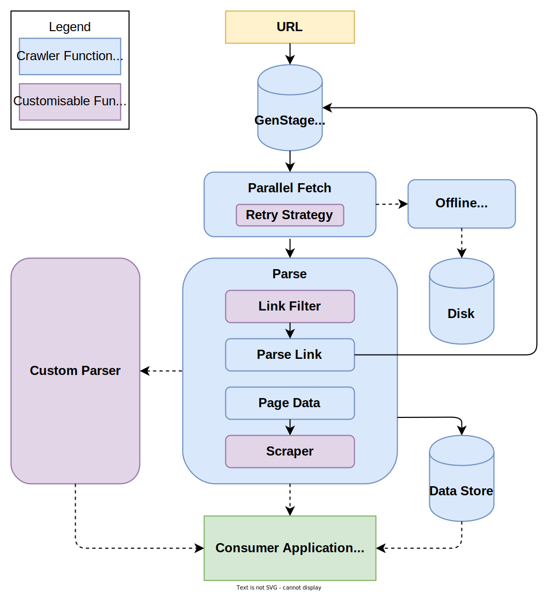

# Crawler

[](https://github.com/fredwu/crawler/actions)
[](https://codebeat.co/projects/github-com-fredwu-crawler-master)
[](https://coveralls.io/github/fredwu/crawler?branch=master)
[](https://hex.pm/packages/crawler)
[](https://hexdocs.pm/crawler/)
[](https://hex.pm/packages/crawler)
[](https://github.com/fredwu/crawler/blob/master/LICENSE.md)
[](https://github.com/fredwu/crawler/commits/master)

A high performance web crawler / scraper in Elixir, with worker pooling and rate limiting via [OPQ](https://github.com/fredwu/opq).

## Features

- Crawl assets (javascript, css and images).
- Save to disk.
- Hook for scraping content.
- Restrict crawlable domains, paths or content types.
- Limit concurrent crawlers.
- Limit rate of crawling.
- Set the maximum crawl depth.
- Set timeouts.
- Set retries strategy.
- Set crawler's user agent.
- Manually pause/resume/stop the crawler.

See [Hex documentation](https://hexdocs.pm/crawler/).

## Architecture

Below is a very high level architecture diagram demonstrating how Crawler works.



## Usage

```elixir
Crawler.crawl("http://elixir-lang.org", max_depths: 2)
```

There are several ways to access the crawled page data:

1. Use [`Crawler.Store`](https://hexdocs.pm/crawler/Crawler.Store.html)
2. Tap into the registry([?](https://hexdocs.pm/elixir/Registry.html)) [`Crawler.Store.DB`](lib/crawler/store.ex)
3. Use your own [scraper](#custom-modules)
4. If the `:save_to` option is set, pages will be saved to disk in addition to the above mentioned places
5. Provide your own [custom parser](#custom-modules) and manage how data is stored and accessed yourself

## Configurations

| Option        | Type    | Default Value               | Description                                                                                                                                                                   |
| ------------- | ------- | --------------------------- | ----------------------------------------------------------------------------------------------------------------------------------------------------------------------------- |
| `:assets`     | list    | `[]`                        | Whether to fetch any asset files, available options: `"css"`, `"js"`, `"images"`.                                                                                             |
| `:save_to`    | string  | `nil`                       | When provided, the path for saving crawled pages.                                                                                                                             |
| `:workers`    | integer | `10`                        | Maximum number of concurrent workers for crawling.                                                                                                                            |
| `:interval`   | integer | `0`                         | Rate limit control - number of milliseconds before crawling more pages, defaults to `0` which is effectively no rate limit.                                                   |
| `:max_depths` | integer | `3`                         | Maximum nested depth of pages to crawl.                                                                                                                                       |
| `:max_pages`  | integer | `:infinity`                 | Maximum amount of pages to crawl.                                                                                                                                             |
| `:timeout`    | integer | `5000`                      | Timeout value for fetching a page, in ms. Can also be set to `:infinity`, useful when combined with `Crawler.pause/1`.                                                        |
| `:retries`    | integer | `2`                         | Number of times to retry a fetch.                                                                                                                                             |
| `:store`      | module  | `Crawler.Store`             | Module for storing the crawled page data and crawling metadata. You can also set it to using your own module, see `Crawler.Store.add_page_data/3` for implementation details. |
| `:force`      | boolean | `false`                     | Force crawling URLs even if they have already been crawled, useful if you want to refresh the crawled data.                                                                   |
| `:scope`      | term    | `nil`                       | Similar to `:force`, but you can pass a custom `:scope` to determine how Crawler should perform on links already seen.                                                        |
| `:user_agent` | string  | `Crawler/x.x.x (...)`       | User-Agent value sent by the fetch requests.                                                                                                                                  |
| `:url_filter` | module  | `Crawler.Fetcher.UrlFilter` | Custom URL filter, useful for restricting crawlable domains, paths or content types.                                                                                          |
| `:retrier`    | module  | `Crawler.Fetcher.Retrier`   | Custom fetch retrier, useful for retrying failed crawls, nullifies the `:retries` option.                                                                                     |
| `:modifier`   | module  | `Crawler.Fetcher.Modifier`  | Custom modifier, useful for adding custom request headers or options.                                                                                                         |
| `:scraper`    | module  | `Crawler.Scraper`           | Custom scraper, useful for scraping content as soon as the parser parses it.                                                                                                  |
| `:parser`     | module  | `Crawler.Parser`            | Custom parser, useful for handling parsing differently or to add extra functionalities.                                                                                       |
| `:encode_uri` | boolean | `false`                     | When set to `true` apply the `URI.encode` to the URL to be crawled.                                                                                                           |
| `:queue`      | pid     | `nil`                       | You can pass in an `OPQ` pid so that multiple crawlers can share the same queue.                                                                                              |

## Custom Modules

It is possible to swap in your custom logic as shown in the configurations section. Your custom modules need to conform to their respective behaviours:

### Retrier

See [`Crawler.Fetcher.Retrier`](lib/crawler/fetcher/retrier.ex).

Crawler uses [ElixirRetry](https://github.com/safwank/ElixirRetry)'s exponential backoff strategy by default.

```elixir
defmodule CustomRetrier do
  @behaviour Crawler.Fetcher.Retrier.Spec
end
```

### URL Filter

See [`Crawler.Fetcher.UrlFilter`](lib/crawler/fetcher/url_filter.ex).

```elixir
defmodule CustomUrlFilter do
  @behaviour Crawler.Fetcher.UrlFilter.Spec
end
```

### Scraper

See [`Crawler.Scraper`](lib/crawler/scraper.ex).

```elixir
defmodule CustomScraper do
  @behaviour Crawler.Scraper.Spec
end
```

### Parser

See [`Crawler.Parser`](lib/crawler/parser.ex).

```elixir
defmodule CustomParser do
  @behaviour Crawler.Parser.Spec
end
```

### Modifier

See [`Crawler.Fetcher.Modifier`](lib/crawler/fetcher/modifier.ex).

```elixir
defmodule CustomModifier do
  @behaviour Crawler.Fetcher.Modifier.Spec
end
```

## Pause / Resume / Stop Crawler

Crawler provides `pause/1`, `resume/1` and `stop/1`, see below.

```elixir
{:ok, opts} = Crawler.crawl("https://elixir-lang.org")

Crawler.running?(opts) # => true

Crawler.pause(opts)

Crawler.running?(opts) # => false

Crawler.resume(opts)

Crawler.running?(opts) # => true

Crawler.stop(opts)

Crawler.running?(opts) # => false
```

Please note that when pausing Crawler, you would need to set a large enough `:timeout` (or even set it to `:infinity`) otherwise parser would timeout due to unprocessed links.

## Multiple Crawlers

It is possible to start multiple crawlers sharing the same queue.

```elixir
{:ok, queue} = OPQ.init(worker: Crawler.Dispatcher.Worker, workers: 2)

Crawler.crawl("https://elixir-lang.org", queue: queue)
Crawler.crawl("https://github.com", queue: queue)
```

## Find All Scraped URLs

```elixir
Crawler.Store.all_urls() # => ["https://elixir-lang.org", "https://google.com", ...]
```

## Examples

### Google Search + Github

This example performs a Google search, then scrapes the results to find Github projects and output their name and description.

See the [source code](examples/google_search.ex).

You can run the example by cloning the repo and run the command:

```shell
mix run -e "Crawler.Example.GoogleSearch.run()"
```

## API Reference

Please see https://hexdocs.pm/crawler.

## Changelog

Please see [CHANGELOG.md](CHANGELOG.md).

## Copyright and License

Copyright (c) 2016 Fred Wu

This work is free. You can redistribute it and/or modify it under the
terms of the [MIT License](http://fredwu.mit-license.org/).
