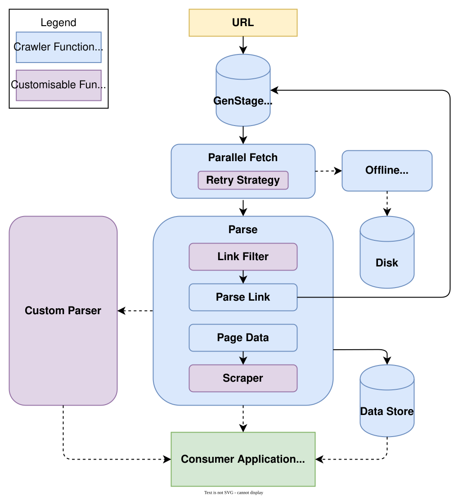

# Crawler

[](https://github.com/fredwu/crawler/actions)
[](https://codebeat.co/projects/github-com-fredwu-crawler-master)
[](https://coveralls.io/github/fredwu/crawler?branch=master)
[](https://hex.pm/packages/crawler)
[](https://hexdocs.pm/crawler/)
[](https://hex.pm/packages/crawler)
[](https://github.com/fredwu/crawler/blob/master/LICENSE.md)
[](https://github.com/fredwu/crawler/commits/master)

A high performance web crawler / scraper in Elixir, with worker pooling and rate limiting via [OPQ](https://github.com/fredwu/opq).

## Features

- Crawl assets (javascript, css and images).
- Save to disk.
- Hook for scraping content.
- Restrict crawlable domains, paths or content types.
- Limit concurrent crawlers.
- Limit rate of crawling.
- Set the maximum crawl depth.
- Set timeouts.
- Set retries strategy.
- Set crawler's user agent.
- Manually pause/resume/stop the crawler.

See [Hex documentation](https://hexdocs.pm/crawler/).

## Architecture

Below is a very high level architecture diagram demonstrating how Crawler works.



The implementation separates these responsibilities:

- `Crawler.Queue` owns each managed queue's workers and rate limiter. `Crawler.QueueHandler` enqueues work, and `Crawler.Worker` runs each fetch and parse.
- `Crawler.Store` exposes the registry and coordinates updates through its internal server. The modules in `lib/crawler/store/` manage page slots, pending work, redirect aliases, and file publication.
- `Crawler.Fetcher` applies crawl policy and records responses. `Crawler.HTTP` checks each redirect before Req follows it.
- The URL module validates browser host spellings and defines page identity. The charset module decodes text responses before parsing and saving.
- `Crawler.Parser` discovers links and invokes the scraper. CSS and JavaScript scanners share decoded link values and original source boundaries with offline rewriting. `Crawler.Linker` builds offline paths, and `Crawler.Snapper` rewrites links and publishes files while preserving unrelated source text.

A scope shares seen URLs and the page budget. Its generation prevents old workers from updating a reset scope. Queue ownership determines which processes `Crawler.stop/1` shuts down; callers can also supply an external queue.

## Usage

```elixir
url = "https://elixir-lang.org"
{:ok, opts} = Crawler.crawl(url, max_depths: 2, store: Crawler.Store)
```

Crawling is asynchronous. Poll `Crawler.running?(opts)` until it returns `false` while the crawl is not paused, then read a processed page:

```elixir
page = Crawler.Store.find_processed({url, opts[:scope]})
```

This returns `nil` if the page was not processed. The default `store: nil` keeps crawl metadata without retaining response bodies. Enable `store: Crawler.Store` to read bodies through the Store API or its `Crawler.Store.DB` registry. You can also use a [custom scraper or parser](#custom-modules), or set `:save_to` to save pages to disk.

Page identity normalizes browser-equivalent domain and IPv4 spellings. Raw bytes that require request escaping share an identity with their escaped form; escaped separators remain distinct. HTTP requests encode Unicode and unsafe path or query bytes into ASCII while preserving valid escapes and an explicit empty query (`?`). Saved links keep fragments after URL sanitization and escape delimiter bytes so those fragments preserve HTML, CSS, and JavaScript source boundaries.

## Configurations

| Option        | Type    | Default Value               | Description                                                                                                                                                                               |
| ------------- | ------- | --------------------------- | ----------------------------------------------------------------------------------------------------------------------------------------------------------------------------------------- |
| `:assets`     | list    | `[]`                        | Whether to fetch any asset files, available options: `"css"`, `"js"`, `"images"`.                                                                                                         |
| `:javascript_goal` | atom | `:module`                 | Source goal for direct JavaScript crawls. Use `:script` for classic JavaScript.                                                                                                          |
| `:save_to`    | string  | `nil`                       | When provided, the path for saving crawled pages.                                                                                                                                         |
| `:workers`    | integer | `10`                        | Maximum number of concurrent workers for crawling.                                                                                                                                        |
| `:interval`   | integer | `0`                         | Rate limit control - number of milliseconds before crawling more pages, defaults to `0` which is effectively no rate limit.                                                               |
| `:max_depths` | integer | `3`                         | Maximum nested depth of pages to crawl.                                                                                                                                                   |
| `:max_pages`  | integer | `:infinity`                 | Maximum amount of pages to crawl.                                                                                                                                                         |
| `:timeout`    | integer or `:infinity` | `5000`          | HTTP receive timeout in milliseconds, passed to Req as `:receive_timeout`.                                                                                                              |
| `:retries`    | integer | `2`                         | Number of retries for tagged HTTP failures. The default retrier propagates callback and programming exceptions without retrying.                                                          |
| `:store`      | module  | `nil`                       | Module for storing the crawled page data and crawling metadata. You can set it to `Crawler.Store` or use your own module, see `Crawler.Store.add_page_data/3` for implementation details. |
| `:force`      | boolean | `false`                     | Reset the scope before a root crawl, removing its pages and counters and invalidating its previous workers. Use an explicit `:scope` to refresh an existing crawl.                       |
| `:scope`      | term    | unique per crawl            | Seen URLs and `:max_pages` belong to one scope. Each crawl gets its own scope unless you pass one. Pass the same scope to share them.                                                      |
| `:user_agent` | string  | `Crawler/x.x.x (...)`       | User-Agent value sent by the fetch requests. The product token selects the matching `robots.txt` group.                                                                                   |
| `:respect_robots` | boolean | `true`                 | Honour `robots.txt`, `nofollow`, meta robots, and `X-Robots-Tag`. A missing robots file allows the crawl. A server error blocks that fetch, and the file is requested again. Set `false` to follow disallowed paths and nofollow links without requesting the file. |
| `:max_body`   | integer | `10485760`                  | Maximum decoded response size in bytes. A larger response is discarded and is not retried.                                                                                                |
| `:url_filter` | module  | `Crawler.Fetcher.UrlFilter` | Custom URL filter. The default keeps ordinary links on the seed site. A custom module replaces that decision.                                                                             |
| `:retrier`    | module  | `Crawler.Fetcher.Retrier`   | Custom fetch retrier, useful for retrying failed crawls, nullifies the `:retries` option.                                                                                                 |
| `:modifier`   | module  | `Crawler.Fetcher.Modifier`  | Custom modifier, useful for adding custom request headers or options.                                                                                                                     |
| `:req_options` | keyword | `[]`                        | Advanced [`Req` request options](https://hexdocs.pm/req/Req.html#new/1-options) forwarded to the HTTP client.                                                                            |
| `:scraper`    | module  | `Crawler.Scraper`           | Custom scraper, useful for scraping content as soon as the parser parses it.                                                                                                              |
| `:parser`     | module  | `Crawler.Parser`            | Custom parser, useful for handling parsing differently or to add extra functionalities.                                                                                                   |
| `:encode_uri` | boolean | `false`                     | When set to `true` apply the `URI.encode` to the URL to be crawled.                                                                                                                       |
| `:queue`      | pid or atom | `nil`                   | Pass an `OPQ` pid or registered name to share a queue. An unavailable name returns `{:error, {:queue_unavailable, name}}`. `Crawler.stop/1` leaves an externally created queue running.     |

HTML script references select the script or module goal from their script type. JavaScript imports use the module goal. Discovery and offline rewriting use the same goal.

## Custom Modules

It is possible to swap in your custom logic as shown in the configurations section. Your custom modules need to conform to their respective behaviours:

### Retrier

See [`Crawler.Fetcher.Retrier`](lib/crawler/fetcher/retrier.ex).

Crawler uses [ElixirRetry](https://github.com/safwank/ElixirRetry)'s exponential backoff strategy by default.

```elixir
defmodule CustomRetrier do
  @behaviour Crawler.Fetcher.Retrier.Spec
end
```

### URL Filter

See [`Crawler.Fetcher.UrlFilter`](lib/crawler/fetcher/url_filter.ex).

Implement `filter(url, opts)` and return `{:ok, true}` to allow the URL, `{:ok, false}` to reject it, or `{:error, reason}` when filtering fails. For an initial URL, the error is returned unchanged without a request or retry; the default parser logs a fixed error message without the reason. Redirect targets are followed only when the filter returns `{:ok, true}`.

The default filter keeps links, image maps, and meta refresh on the seed site. One leading `www` label is ignored. `http` on port 80 and `https` on port 443 match each other. Every other pair must use the same port. Scripts, stylesheets, images, and fonts may still be fetched from another host, including a CDN. A custom filter replaces this decision. Local servers stay reachable.

Cookies are stored for the crawl scope. A redirect rebuilds `Cookie` for the next URL, so a secure, path-scoped, or deleted cookie is not sent again. The same host keeps the caller's `Cookie`, `Authorization`, and other custom headers when the scheme or port changes. A redirect that changes host drops them. The next host receives only cookies that belong to it. Resetting the scope clears the jar, and a response from the previous crawl does not restore it. A missing content type is not treated as HTML. Gzip and deflate responses are read as the decoded page, up to `:max_body`.

```elixir
defmodule CustomUrlFilter do
  @behaviour Crawler.Fetcher.UrlFilter.Spec
end
```

### Scraper

See [`Crawler.Scraper`](lib/crawler/scraper.ex).

```elixir
defmodule CustomScraper do
  @behaviour Crawler.Scraper.Spec
end
```

### Parser

See [`Crawler.Parser`](lib/crawler/parser.ex).

```elixir
defmodule CustomParser do
  @behaviour Crawler.Parser.Spec
end
```

### Modifier

See [`Crawler.Fetcher.Modifier`](lib/crawler/fetcher/modifier.ex).

```elixir
defmodule CustomModifier do
  @behaviour Crawler.Fetcher.Modifier.Spec
end
```

`headers/1` should return request headers and `opts/1` should return
[`Req` request options](https://hexdocs.pm/req/Req.html#new/1-options).

Header names merge case-insensitively in this order, with later values taking precedence: default headers, `headers/1`, `opts/1[:headers]`, then `req_options[:headers]`. Other header names are retained.

Use `req_options: [redirect: false]` to return redirect responses without following their `Location`. With `redirect: true` (the default), each target must pass the crawl's URL filter before it is fetched. The obsolete `:follow_redirects` option is rejected with `ArgumentError` at the HTTP boundary; use `:redirect`. Redirect logging is disabled by default; set `:redirect_log_level` in `:req_options` or the modifier's options to enable it.

## Pause / Resume / Stop Crawler

Crawler provides `pause/1`, `resume/1` and `stop/1`, see below.

```elixir
{:ok, opts} = Crawler.crawl("https://elixir-lang.org")

Crawler.running?(opts) # => true

Crawler.pause(opts)

Crawler.running?(opts) # => false

Crawler.resume(opts)

Crawler.running?(opts) # => true

Crawler.stop(opts)

Crawler.running?(opts) # => false
```

Pausing suspends queue dispatch. Requests that have already started can still finish, subject to the HTTP receive timeout. `Crawler.running?/1` reports `false` while the queue is paused.

When a crawl started its own queue, `Crawler.stop/1` shuts that queue down, including its workers and its rate limiter. A queue created with `OPQ.init/1` keeps running. To stop an owned queue, the options must include both its `:queue` and the `:scope` that started it. Pass the options returned by `Crawler.crawl/2`. Stopping does not change the caller's process flags.

Stopping a crawl drops that scope's URLs, counters, and in-flight page slots. Another scope's stored pages stay in place. A crawl that finishes on its own keeps the pages recorded with `:store`.

If the Store restarts, queues started by Crawler stop. Start a new crawl. Externally created queues remain running, but their old jobs cannot update new pages, counters, or snapshots.

A failed URL, or a URL whose handler crashes, is fetched once during that crawl. After the crawl is idle, a later crawl of the same scope can fetch that URL again without `:force`.

Saving a page does not block other crawls. A newer crawl of that page keeps the file when an older save is still unfinished. Saves that finish at the same time leave one complete file.

## Multiple Crawlers

It is possible to start multiple crawlers sharing the same queue.

```elixir
{:ok, queue} = OPQ.init(worker: Crawler.Dispatcher.Worker, workers: 2)

Crawler.crawl("https://elixir-lang.org", queue: queue)
Crawler.crawl("https://github.com", queue: queue)
```

`Crawler.stop/1` does not stop this queue, because the caller created it. If that process has already stopped, the crawl is not run and the scope's counters stay unchanged.

Crawls can also share a queue that Crawler started: pass `queue: opts[:queue]` from the crawl that created it. Stopping a different scope leaves the queue running. Stopping the scope that started it shuts the queue down. The other crawls stop making progress. Pages they have already stored remain readable.

## Find All Scraped URLs

```elixir
Crawler.Store.all_urls() # => ["https://elixir-lang.org", "https://google.com", ...]
```

## Examples

### Google Search + Github

This example performs a Google search, then scrapes the results to find Github projects and output their name and description. It accepts HTTPS URLs on the exact Google Search and GitHub hosts and rejects URL credentials.

See the [source code](examples/google_search.ex).

You can run the example by cloning the repo and run the command:

```shell
mix run -e "Crawler.Example.GoogleSearch.run()"
```

## API Reference

Please see https://hexdocs.pm/crawler.

## Development

Use the Erlang and Elixir versions in [`.tool-versions`](https://github.com/fredwu/crawler/blob/master/.tool-versions) (OTP 26.1.1 and Elixir 1.17.3 compiled for OTP 26). The project requires Elixir 1.17 or later for its Unicode dependencies. Install dependencies with `mix deps.get`. CI runs `mix test`.

Run these checks before submitting a change:

```shell
mix format --check-formatted
mix recode --dry --no-autocorrect --force --no-color
mix compile --warnings-as-errors
MIX_ENV=test mix compile --warnings-as-errors
mix dialyzer
mix test --cover
mix docs --warnings-as-errors
```

Run format, Recode, and docs in the default development environment; their dependencies are development-only. The Recode command reports issues without applying corrections. `mix test --cover` uses ExCoveralls. Review the generated API documentation in `doc/index.html`.

If your shell still selects an older runtime, prefix these commands with `mise exec elixir@1.17.3-otp-26 erlang@26.1.1 --`.

Tests use [Req.Test](https://hexdocs.pm/req/Req.Test.html) through `Crawler.ReqTestSite`, so the suite does not need live websites. Use `Crawler.TestCase` for HTTP fixtures and `start_crawl/2` to track queues for cleanup. Use `await_idle/1` before checking final crawl results, a unique scope for independent crawl state, and distinct temporary paths for saved files. For timeout tests, use the fixture's `:handler_timeout` option and explicit process signals instead of timing a live request.

For raw custom adapters, a successful `start_crawl/2` automatically registers cleanup that clears the crawl's scope and stops its owned queue. External and borrowed queues remain running.

After the final changes, run ten fresh suites with distinct seeds to check for order-dependent failures:

```shell
for seed in {1..10}; do
  mix test --warnings-as-errors --seed "$seed" || exit 1
done
```

Record the seeds and results. If a run fails, reproduce its seed, fix the cause, then restart all ten runs.

## Changelog

Please see [CHANGELOG.md](CHANGELOG.md).

## Copyright and License

Copyright (c) 2016 Fred Wu

This work is free. You can redistribute it and/or modify it under the
terms of the [MIT License](http://fredwu.mit-license.org/).
